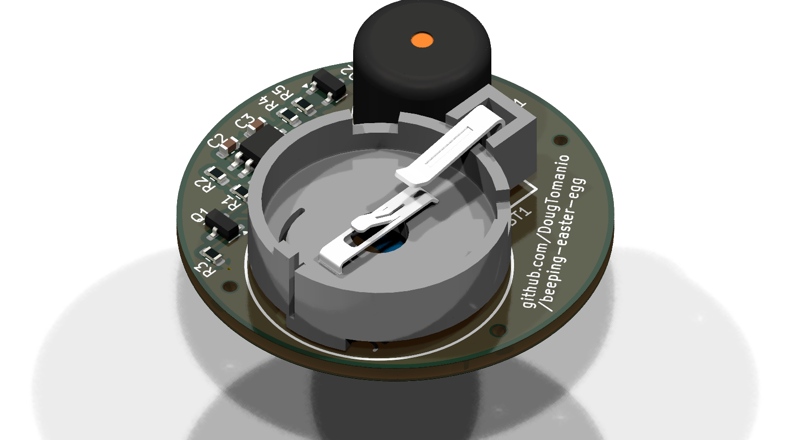
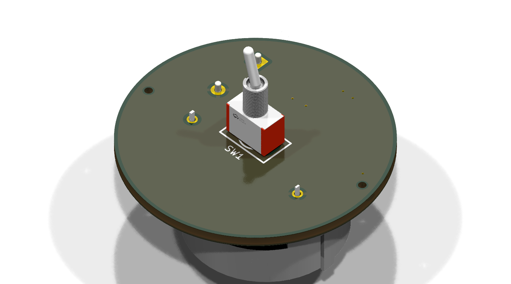
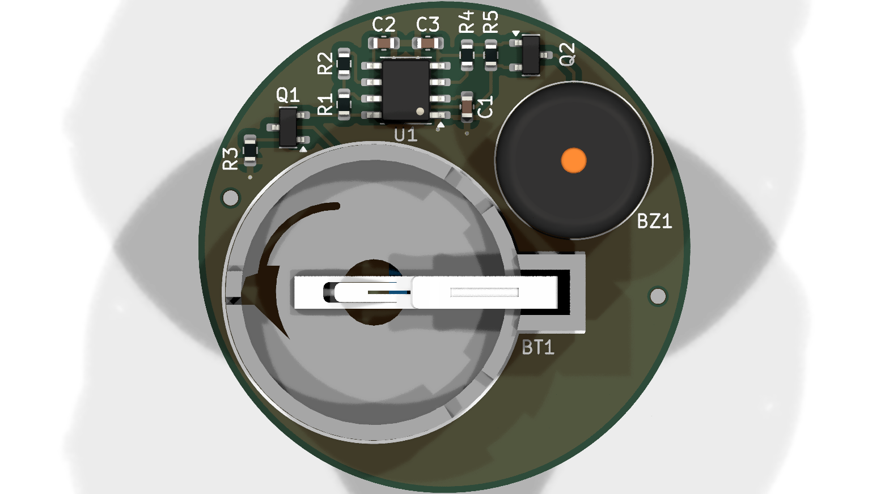
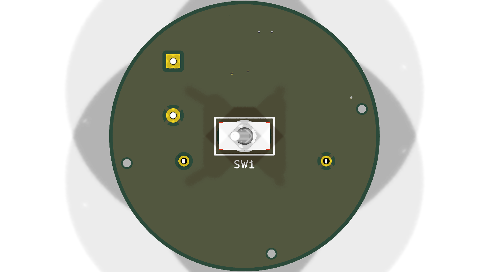
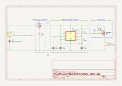

# Beeping Easter Egg 🥚🔊

<p float="center">
  
  
</p>
<p float="center">
   
  
</p>


## Generate render pngs and schematic svg (run from the KiCad command Prompt)
```
kicad-cli pcb render --floor --rotate '-45,0,45' -o ./render_top_isometric.png ./beeping-easter-egg.kicad_pcb
kicad-cli pcb render --floor --rotate '-45,180,45' -o ./render_bottom_isometric.png ./beeping-easter-egg.kicad_pcb
kicad-cli pcb render --floor --rotate '0,0,0' -o ./render_top.png ./beeping-easter-egg.kicad_pcb
kicad-cli pcb render --floor --rotate '0,180,0' -o ./render_bottom.png ./beeping-easter-egg.kicad_pcb
kicad-cli sch export svg ./beeping-easter-egg.kicad_sch
```

## KiCad plugins / tools / scripts
* https://github.com/bennymeg/Fabrication-Toolkit
* https://github.com/yaqwsx/KiKit
* https://github.com/uPesy/easyeda2kicad.py

## Component calculations
[component-calculations.md](component-calculations.md)