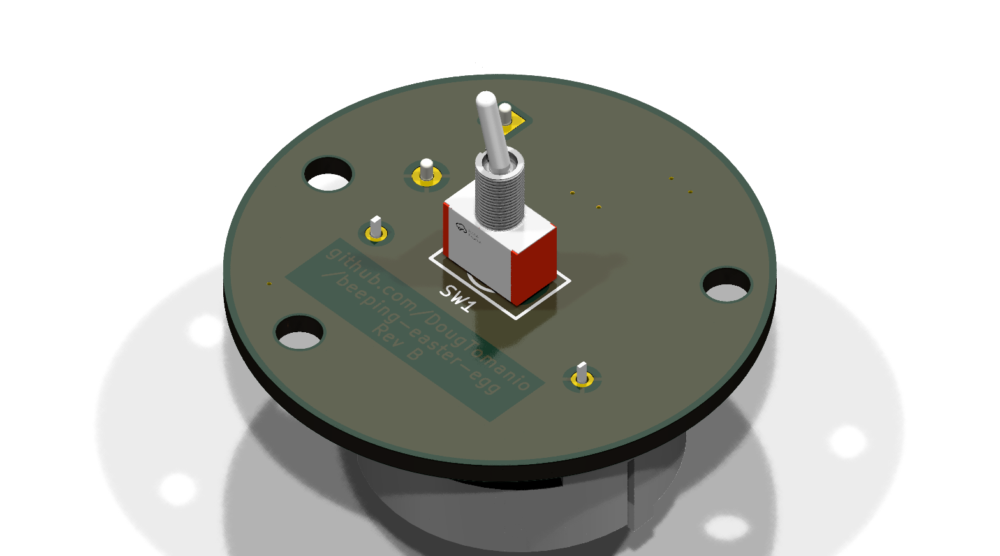
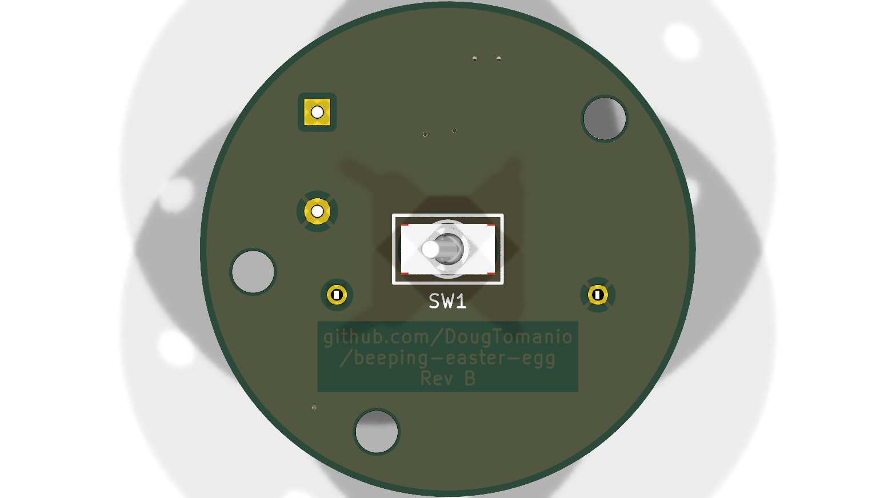

# Beeping Easter Egg 🥚🔊

<p float="center">
  
  
</p>
<p float="center">
   
  
</p>


## Generate fabrication files
```
docker run --rm -v ${PWD}:/app -e ROWS=4 -e COLS=3 kicad/kicad:9.0 bash /app/scripts/generate-fabrication-files.sh
```

## Generate render pngs and schematic svg
```
docker run --rm -v ${PWD}:/app kicad/kicad:9.0 bash /app/scripts/generate-renders-for-readme.sh
```

## KiCad plugins / tools / scripts
* https://github.com/yaqwsx/KiKit
* https://github.com/uPesy/easyeda2kicad.py

## Component calculations
[component-calculations.md](component-calculations.md)

## TODO
* Try KiCad jobset to replace generate-renders-for-readme.sh
* Use official KiKit docker image once it supports KiCad 9
* Find a proper 3D model for switch
