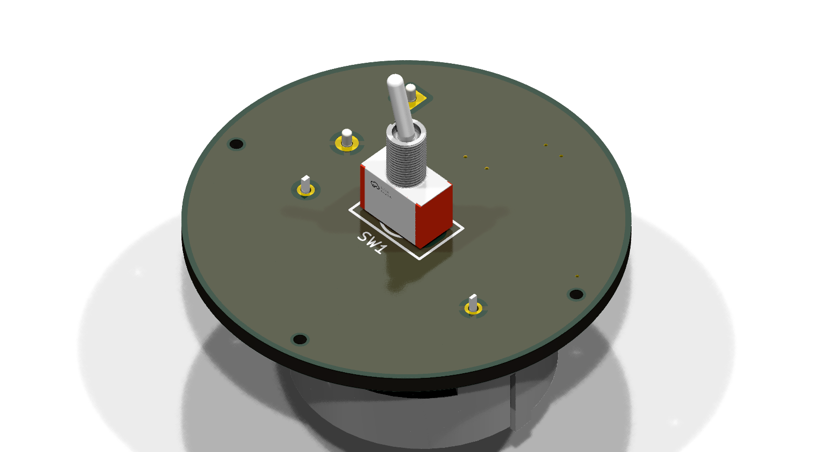
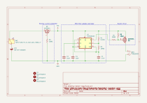

# Beeping Easter Egg 🥚🔊

<p float="center">
  
  
</p>
<p float="center">
   
  
</p>


## Generate render pngs and schematic svg (run from the KiCad command Prompt)
```
kicad-cli pcb render --floor --rotate '-45,0,45' -o ./render_top_isometric.png ./beeping-easter-egg.kicad_pcb
kicad-cli pcb render --floor --rotate '-45,180,45' -o ./render_bottom_isometric.png ./beeping-easter-egg.kicad_pcb
kicad-cli pcb render --floor --rotate '0,0,0' -o ./render_top.png ./beeping-easter-egg.kicad_pcb
kicad-cli pcb render --floor --rotate '0,180,0' -o ./render_bottom.png ./beeping-easter-egg.kicad_pcb
kicad-cli sch export svg ./beeping-easter-egg.kicad_sch
```

## KiCad plugins / tools / scripts
* https://github.com/bennymeg/Fabrication-Toolkit
* https://github.com/yaqwsx/KiKit
* https://github.com/uPesy/easyeda2kicad.py

## Calculating component values for the 555 astable circuit

Formulas for 555 astable circuit timing
$$ time\ high\ t_1 = ln(2) * (R_1 + R_2) * C $$
$$ time\ low\ t_2 = ln(2) * R_1 * C $$
$$ period\ T = t_1 + t_2 $$
$$ frequency\ f = \frac{1}{T} $$
$$ duty\ cycle\ D = \frac{t_1}{T} $$

Putting R_1 and R_2 in terms of f, D, and C
$$ R_1 = \frac{1 - D}{f * ln(2) * C} $$
$$ R_2 = \frac{2D - 1}{f * ln(2) * C} $$


We want a beep of 1.5 Hz with a 25\% duty cycle. Since our buzzer will sound when the signal from the 555 is low, our circuit will need the opposite duty cycle. We choose a reasonably small standard value for C to keep current/power low.
$$ f = 1.5 Hz $$
$$ D = 100\% - 25\% = 75\% $$
$$ C = 47 nF $$

So
$$ R_1 = \frac{1 - D}{f * ln(2) * C} = \frac{1 - 75\%}{1.5 Hz * ln(2) * 47 nF} = 5.1159 M\Omega $$
$$ R_2 = \frac{2D - 1}{f * ln(2) * C} = \frac{2 * 75\% - 1}{1.5 Hz * ln(2) * 47 nF} = 10.2319 M\Omega $$

Since there is no need for this timing to be exact, we choose the closest standard values for R_1 and R_2, giving us our component values of 
$$ R_1 = 5.1 M\Omega $$
$$ R_2 = 10 M\Omega $$
$$ C = 47 nF $$

So our actually frequency and duty cycle will be
$$ t_1 = ln(2) * (R_1 + R_2) * C = ln(2) * (5.1 M\Omega + 10 M\Omega) * 47 nF = 0.49 s $$
$$ t_2 = ln(2) * R_1 * C = ln(2) * 5.1 M\Omega * 47 nF = 0.17 s $$
$$ T = t_1 + t_2 = 0.49 s + 0.17 s = 0.66 s $$
$$ f = \frac{1}{T} = \frac{1}{0.66 s} = 1.52 Hz $$
$$ D = \frac{t_1}{T} = \frac{0.49 s}{0.66 s} = 74\% $$

Giving us a beep of $1.52Hz$ with a $26\%$ duty cycle. That is a $0.17$ second long beep every $0.66$ seconds. 
